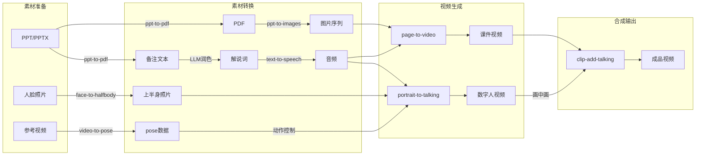

# Geminar Toolchain

数字人视频制作工具链。

## 工具列表

| 工具 | 功能 | 输入 | 输出 |
|------|------|------|------|
| [ppt-to-pdf](./ppt-to-pdf) | PPTX 转 PDF + 提取备注 | PPTX | PDF + 备注文本 |
| [ppt-to-images](https://github.com/HQIT/ppt-to-images) | PDF 转图片序列 | PDF | 图片序列 |
| [text-to-speech](https://github.com/HQIT/text-to-speech) | 文字转语音（Edge TTS） | 文本 | 音频文件 |
| [face-to-halfbody](./face-to-halfbody) | 头像换脸到身体模板 | 人脸照片 + 模板 | 上半身照片 |
| [portrait-to-talking](https://github.com/HQIT/portrait-to-talking) | 肖像 + 音频生成数字人视频 | 上半身照片 + 音频 | 数字人视频 |
| [echomimic-api](./echomimic-api) | EchoMimic V2 API 服务 | HTTP 请求 | 数字人视频 |
| [page-to-video](./page-to-video) | 图片 + 音频合成视频 | 图片 + 音频 | 视频 |
| [video-to-pose](./video-to-pose) | 从视频提取 pose 数据 | 视频 | pose 数据 |
| [clip-add-talking](https://github.com/HQIT/clip-add-talking) | 数字人画中画叠加 | 背景视频 + 数字人视频 | 合成视频 |

## 典型流程



## 快速开始（Docker 方式，推荐）

### 1. 克隆仓库

```bash
git clone --recurse-submodules https://github.com/HQIT/geminar-toolchain.git
cd geminar-toolchain
```

### 2. 构建镜像

```bash
docker-compose build
```

### 3. 准备素材

```bash
# 将素材放到 shared/inputs 目录
cp your-presentation.pptx shared/inputs/
cp your-portrait.jpg shared/inputs/
```

### 4. 运行 Pipeline

```bash
# 启动服务（包含 echomimic-api GPU 服务）
docker-compose up -d echomimic-api

# 运行转换
docker-compose run --rm toolchain \
    /app/shared/inputs/your-presentation.pptx \
    /app/shared/inputs/your-portrait.jpg \
    /app/shared/outputs/output.mp4
```

或单独运行工具链容器（不含数字人生成）：

```bash
docker run --rm -v $(pwd)/shared:/app/shared geminar-toolchain \
    /app/shared/inputs/presentation.pptx \
    /app/shared/inputs/portrait.jpg \
    /app/shared/outputs/output.mp4
```

## 本地安装（不使用 Docker）

### 1. 系统依赖

```bash
# ffmpeg
sudo apt install ffmpeg              # Ubuntu/Debian
sudo yum install ffmpeg              # CentOS/RHEL
brew install ffmpeg                  # macOS

# LibreOffice（用于 PPT 转 PDF）
sudo apt install libreoffice         # Ubuntu/Debian
```

### 2. Python 依赖

```bash
python -m venv venv
source venv/bin/activate

pip install python-pptx pdf2image Pillow edge-tts moviepy requests python-dotenv
```

### 3. 运行

```bash
./PIPELINE.sh input.pptx portrait.jpg output.mp4
```

## 架构

```
┌─────────────────────────────────────┐
│  geminar-toolchain 容器 (CPU)       │
│  - ppt-to-pdf (libreoffice)         │
│  - ppt-to-images (pdf2image)        │
│  - text-to-speech (edge-tts)        │
│  - page-to-video (ffmpeg)           │
│  - clip-add-talking (ffmpeg)        │
│  - portrait-to-talking (client)     │
└──────────────┬──────────────────────┘
               │ HTTP API
               ▼
┌─────────────────────────────────────┐
│  echomimic-api 容器 (GPU)           │
│  - EchoMimic V2 模型                │
│  - CUDA + PyTorch                   │
└─────────────────────────────────────┘
```

## 环境变量

| 变量 | 说明 | 默认值 |
|------|------|--------|
| `ECHOMIMIC_URL` | EchoMimic API 地址 | `http://echomimic-api:8000/a2v` |

## Submodules

| 路径 | 仓库 |
|------|------|
| ppt-to-images | https://github.com/HQIT/ppt-to-images |
| text-to-speech | https://github.com/HQIT/text-to-speech |
| portrait-to-talking | https://github.com/HQIT/portrait-to-talking |
| clip-add-talking | https://github.com/HQIT/clip-add-talking |
| echomimic-api/echomimic_v2 | https://github.com/antgroup/echomimic_v2 |

## License

MIT
