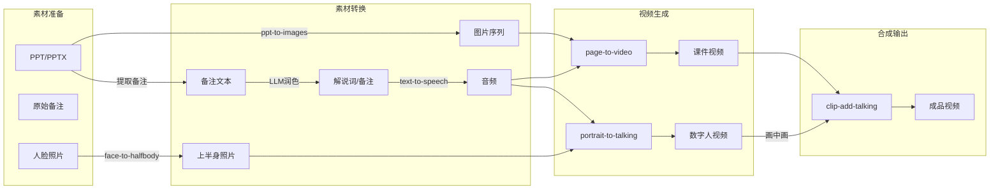

# Geminar Toolchain

数字人视频制作工具链。

## 工具列表

| 工具 | 功能 | 输入 | 输出 |
|------|------|------|------|
| [ppt-to-images](https://github.com/HQIT/ppt-to-images) | PPT/PPTX/PDF 转图片，可提取备注作为解说词 | PPT/PPTX/PDF | 图片序列 + 备注文本 |
| [text-to-speech](https://github.com/HQIT/text-to-speech) | 文字转语音，支持讯飞等多种 TTS 服务 | 文本 | 音频文件 |
| [face-to-halfbody](./face-to-halfbody) | 头像换脸到身体模板，生成上半身照片（基于 InsightFace） | 人脸照片 + 模板 | 上半身照片 |
| [portrait-to-talking](https://github.com/HQIT/portrait-to-talking) | 肖像照片 + 音频生成数字人讲话视频 | 上半身照片 + 音频 | 数字人视频 |
| [echomimic-api](./echomimic-api) | EchoMimic V2 的 API 服务封装，供 portrait-to-talking 调用 | HTTP 请求 | 数字人视频 |
| [page-to-video](./page-to-video) | 静态图片 + 音频合成为视频，用于课件页面配音 | 图片 + 音频 | 视频 |
| [video-to-pose](./video-to-pose) | 从视频中提取 pose 骨骼数据，用于动作复用 | 视频 | pose 数据 |
| [clip-add-talking](https://github.com/HQIT/clip-add-talking) | 将数字人视频以画中画形式叠加到背景视频 | 背景视频 + 数字人视频 | 合成视频 |

## 典型流程



## 安装

### 克隆仓库（含 submodule）

```bash
git clone --recurse-submodules https://github.com/HQIT/geminar-toolchain.git
```

### 更新 submodule

```bash
git submodule update --init --recursive
```

## Submodules

| 路径 | 仓库 |
|------|------|
| ppt-to-images | https://github.com/HQIT/ppt-to-images |
| text-to-speech | https://github.com/HQIT/text-to-speech |
| portrait-to-talking | https://github.com/HQIT/portrait-to-talking |
| clip-add-talking | https://github.com/HQIT/clip-add-talking |
| echomimic-api/echomimic_v2 | https://github.com/antgroup/echomimic_v2 |

## License

MIT
